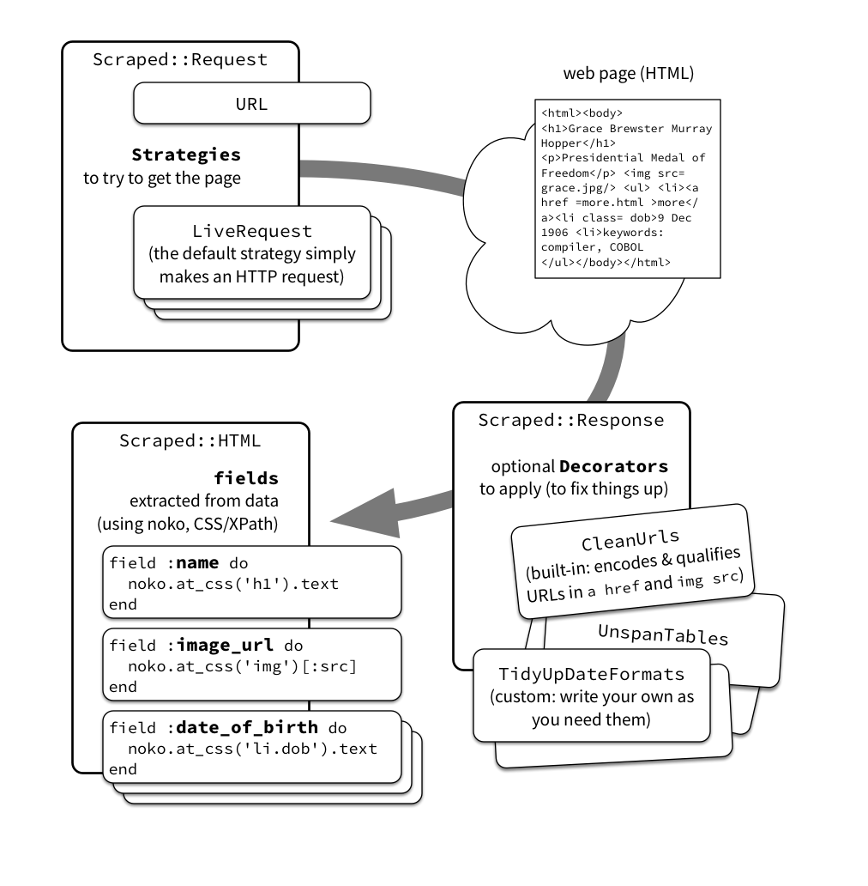

# Scraped

Write declarative scrapers in Ruby.

If you need to write a webscraper (especially one that hits a page which lists a load of other pages, and jumps into each of _those_ pages to pull out the same data) the `scraped` gem will help you write it quickly and clearly.

## Installation

Add this line to your application's Gemfile:

```ruby
gem 'scraped'
```

And then execute:

    $ bundle

Or install it yourself as:

    $ gem install scraped

## Usage

To write a standard HTML scraper, start by creating a subclass of `Scraped::HTML` for each _type_ of page you're scraping. Then specify the (data) fields you want to extract from that. You can control the strategy used to get the page, and decorate the response you get back to make it easier to parse.



### Example scraping example.com

Here's the HTML source from the webpage at [example.com](http://example.com):

```html
<html>
<body>
<div>
  <h1>Example Domain</h1>
  <p>This domain is established to be used for illustrative examples
     in documents. You may use this domain in examples without prior
     coordination or asking for permission.</p>
  <p><a href="http://www.iana.org/domains/example">More information...</a></p>
</div>
</body>
</html>
```

So, if that's your target and you want to get data such as **title** and **more info URL** from that page, you pick them out as fields with [Nokogiri](http://www.nokogiri.org/) (using CSS selectors, in this example):

```ruby
require 'scraped'

class ExamplePage < Scraped::HTML
  field :title do
    noko.at_css('h1').text
  end

  field :more_info_url do
    noko.at_css('a')[:href]
  end
end
```

Now you've defined your `ExamplePage`, you can create a new instance and pass in a `Scraped::Response` instance. The resulting `page` has the data you've scraped:

```ruby
page = ExamplePage.new(response: Scraped::Request.new(url: 'http://example.com').response)

page.title
# => "Example Domain"

page.more_info_url
# => "http://www.iana.org/domains/reserved"

page.to_h
# => { :title => "Example Domain", :more_info_url => "http://www.iana.org/domains/reserved" }
```

You can see that those fields now contain the data scraped from `ExamplePage`, and of course the `.to_h` is handy if you want to dump this into a database. That's why we call each data item you've picked out a `field` — if you're scraping data that's going into a database, often these will be fields on each record. 

### Dealing with sections of a page

In the example above, the scraper was handling a whole webpage; but often you're only interested in working with part of a page. For example, you might want to scrape just a table containing a list of people and some associated data.

To do this, use the `fragment` method, passing it a one-entry hash: the key is the `noko` fragment you want to use, and the value is the class that should handle that fragment.

```ruby
  fragment row => MemberRow
```

In the example below, the fragment is one "table row" (an HTML `tr` element), within the `table` which has a CSS class of `members-list`. The `MemberRow` class is extracting fields from the fragment, rather than the whole page.

```ruby
class MemberRow < Scraped::HTML
  field :name do
    noko.css('td')[2].text
  end

  field :party do
    noko.css('td')[3].text
  end
end

class AllMembersPage < Scraped::HTML
  field :members do
    noko.css('table.members-list tr').map do |row|
      fragment row => MemberRow
    end
  end
end
```

If you restrict your class to a fragment like this, the CSS or XPath expressions you use to identify the data you want can often be simpler. In the example above, `td[2]` is the column with index `2` (that is, the third column) in the table row.

## Extending

There are two main ways to extend `scraped` with your own custom logic — custom request strategies and decorated responses.

Request strategies allow you to change _where_ (and perhaps _how_) the scraper gets its responses from. By default, `scraped` uses its built-in `LiveRequest` strategy, which attempts to make an HTTP request to the URL provided. The response to that request is typically an HTML page, and it's that response that gets passed to your scraper to work on.

When you need more control over how this works, you can create [custom request strategies](#custom-request-strategies). For example, you might want to make requests to `archive.org` if the site you're scraping is unavailable at the moment the scraper runs. Or you may want to use a cache and only refresh on certain calendar conditions. Or negotiate authentication before making the request.

Decorated responses allow you to manipulate the response before it's passed to the scraper. This is useful because sometimes your scraper's code will be much simpler if you clean up or standardise the incoming page before you parse it.
 
`scraped` comes with some [built-in decorators](#built-in-decorators) for common tasks. For example, `CleanUrls` (see below) tidies up all the link and image source URLs before your scraper code extracts them. You can write your own [custom decorators](#custom-response-decorators) too, to fix up something specific or idiosyncratic about the pages you're scraping.

### Custom request strategies

To make a custom request strategy, create a class that subclasses `Scraped::Request::Strategy` and defines a `response` method:

```ruby
class FileOnDiskRequest < Scraped::Request::Strategy
  def response
    { body: open(filename).read }
  end

  private

  def filename
    @filename ||= File.join(URI.parse(url).host, Digest::SHA1.hexdigest(url))
  end
end
```

The `response` method should return a `Hash` which has a `body` key. You can also include `status` and `headers` parameters in the hash to fill out those fields in the response. If not given, `status` will default to `200` (OK) and `headers` will default to `{}` (empty).

To use a custom request strategy pass it to `Scraped::Request`:

```ruby
request = Scraped::Request.new(url: 'http://example.com', strategies: [FileOnDiskRequest, Scraped::Request::Strategy::LiveRequest])
page = MyPersonPage.new(response: request.response)
```

Note that you can provide multiple strategies, and `scraped` will try each in turn until one results in a response.

### Custom response decorators

We've found decorators useful in our own work. For example, we "unspan" fiddly HTML tables that have `colspan` in them, because that makes it much easier to extract data once tables have been normalised for every row to have the same number of columns. Sometimes it's helpful to clean up whitespace by converting HTML entities such as `&nbsp;` before parsing too.

To manipulate the response before it is processed by the scraper, create a class that subclasses `Scraped::Response::Decorator`. This class must define
a `body` method, as well as (optionally) `url`, `status`, or `headers`.

```ruby
class AbsoluteLinks < Scraped::Response::Decorator
  def body
    doc = Nokogiri::HTML(super)
    doc.css('a').each do |link|
      link[:href] = URI.join(url, link[:href]).to_s
    end
    doc.to_s
  end
end
```

You can access the current request body by calling `super` from your method. You can also call `url`, `headers` or `status` to access those properties of the current response.

To use a response decorator you need to use the `decorator` class method in a `Scraped::HTML` subclass:

```ruby
class PageWithRelativeLinks < Scraped::HTML
  decorator AbsoluteLinks

  # Other fields...
end
```

_Note: see `CleanUrls` in [Built-in decorators](#built-in-decorators), which is a decorator that implements a more thorough version of this example._

### Configuring requests and responses

When passing an array of request strategies or response decorators you should always pass the class, rather than the instance. If you want to configure an instance you can pass in a two-element array where the first element is the class and the second element is the config:

```ruby
class CustomHeader < Scraped::Response::Decorator
  def headers
    response.headers.merge('X-Greeting' => config[:greeting])
  end
end

class ExamplePage < Scraped::HTML
  decorator CustomHeader, greeting: 'Hello, world'
end
```

The code above adds this header to the response: `X-Greeting: Hello, world`.

### Passing request headers

Note that you don't need to define a custom strategy if you just want to set headers on a request. You can explicitly pass a `headers:` argument to `Scraped::Request.new`:

```ruby
response = Scraped::Request.new(url: 'http://example.com', headers: { 'Cookie' => 'user_id' => '42' }).response
page = ExamplePage.new(response: response)
```

#### Inheritance with decorators

When you inherit from a class that already has decorators the child class will
also inherit the parent's decorators. There's currently no way to re-order or
remove decorators in child classes, though that _may_ be added in the future.

### Built-in decorators

#### Clean link and image URLs

If your scraper is capturing URLs, you may find that they occur in the HTML as _relative_ URLs. It's better to convert them all to fully-qualified absolute URLs before your scraper extracts them. This is such a common inconvenience that the `scraped` gem comes with support for this out of the box with the `Scraped::Response::Decorator::CleanUrls` decorator.

The `CleanUrls` decorator also fixes up any encoding issues the URL may have, as part of making sure it's fully-qualified.

So if you apply the `CleanUrls` decorator, any `src` or `href` attributes of image or anchor elements respectively will be correctly encoded and made absolute.

```ruby
require 'scraped'

class MemberPage < Scraped::HTML
  decorator Scraped::Response::Decorator::CleanUrls

  field :image do
    # Image url will be absolute thanks to the decorator.
    noko.at_css('.profile-picture/@src').text
  end
end
```

## Declarative tests

We've also been working on making it easy to write simple, declarative tests for scrapers: see [scraper-test](https://github.com/everypolitician/scraper_test). That's useful because often you can state very clearly what data (the fields and their values) you're expecting your scraper to return before you've even started writing it.

## Development

If you want to work on `scraped` itself (rather than simply using it or writing custom strategies or decorators), this is for you.

After checking out the repo, run `bin/setup` to install dependencies. Then, run `rake test` to run the tests. You can also run `bin/console` for an interactive prompt that will allow you to experiment.

To install this gem onto your local machine, run `bundle exec rake install`. To release a new version, update the version number in `version.rb`, and then run `bundle exec rake release`, which will create a git tag for the version, push git commits and tags, and push the `.gem` file to [rubygems.org](https://rubygems.org).

## Contributing

Bug reports and pull requests are welcome on GitHub at https://github.com/everypolitician/scraped.

## License

The gem is available as open source under the terms of the [MIT License](http://opensource.org/licenses/MIT).